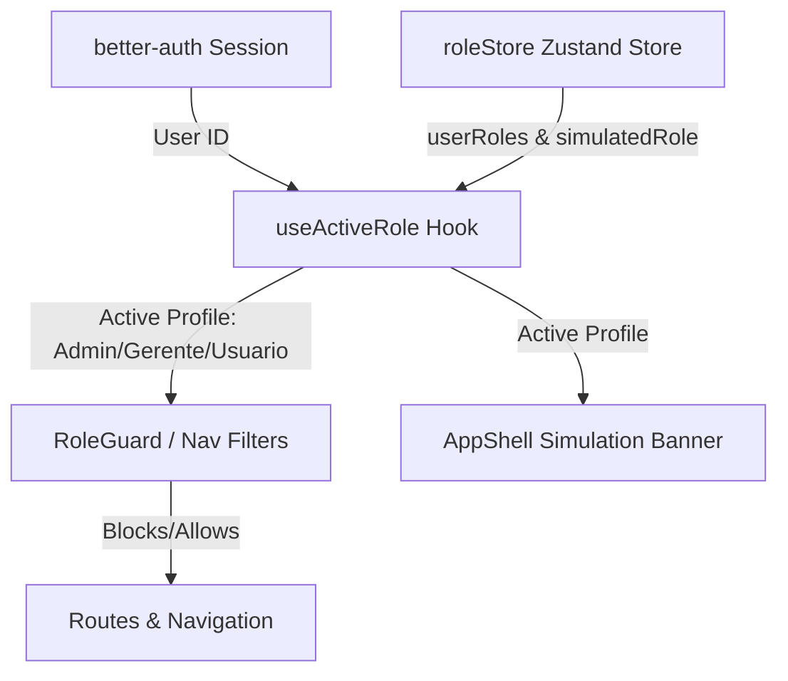

# Design Spec: Access Tab Premium & Integrated Experience

This specification details the architecture, UX, and integration plan for upgrading the **Acesso** (Access) tab under the settings panel in Optsolv PMS. It introduces real-time session role binding, simulation capabilities for administrators, advanced search/filter options for system users, and a premium categorised matrix grid.

## Architectural Overview



1. **Active Session Binding**: The system reactively reads the authenticated user's ID via `better-auth`.
2. **Real Profile Determination**:
   - Matches the authenticated `userId` against `userRoles` inside the Zustand persistent store.
   - **First Run Fallback**: If `userRoles` is completely empty (e.g., initial local database run), the first active user automatically receives the `'admin'` role to prevent administrative lockout. Subsequent users default to `'usuario'`.
3. **Role Impersonation (Simulation)**:
   - Only users with the actual, underlying `'admin'` role can activate the simulated state (`simulatedRole`).
   - If a non-admin user attempts to simulate or access simulated values, they are ignored, defaulting strictly to their assigned `userRoles[userId]` or `'usuario'`.

---

## Detailed Specifications

### 1. Store Refactoring (`roleStore.ts`)

The Zustand store will be updated to handle simulation states separate from real profile states, while maintaining persistence for permissions and role assignments.

```typescript
export type UserRole = 'admin' | 'gerente' | 'usuario';

export type RoleStore = {
  // Impersonation state (Admins only)
  simulatedRole: UserRole | null;
  setSimulatedRole: (role: UserRole | null) => void;

  // Module access rules
  permissions: Record<string, UserRole[]>;
  togglePermission: (module: string, role: UserRole) => void;
  resetPermissions: () => void;

  // Local persistent directory matching user IDs to UserRole
  userRoles: Record<string, UserRole>;
  setUserRole: (userId: string, role: UserRole) => void;
};
```

---

### 2. Live Simulation Banner (`AppShell.tsx`)

When an administrator activates a simulated profile, a global warning banner appears above the main header, ensuring clear context that the system's active permissions are currently limited.

- **Trigger**: Displayed if `realRole === 'admin'` AND `simulatedRole !== null`.
- **Styling**: Slim full-width banner at the very top of the layout. High contrast but fits into the existing UI design.
  - Background: Amber-500/15 (dark theme compatible).
  - Border: Subtle bottom border amber-500/20.
  - Text: Amber-800 / Amber-300 (dark mode) with warning/eye icon.
- **Actions**: A "Voltar ao perfil real" (Return to real profile) button which immediately triggers `setSimulatedRole(null)`.

---

### 3. Redesigned Access Tab UI (`SettingsPage.tsx`)

#### Card A: Simulation Impersonation Panel
- Standard switcher buttons are updated into a modern administrative dashboard panel.
- Only visible if the currently logged-in user's **real** profile is `'admin'`.
- Outlines the current impersonation status clearly, letting the admin toggle between profiles with a single click.

#### Card B: Categorized Permission Matrix
- Replaces the generic flat table with a categorised grid representing modules logically:
  - **Operacional**: `dashboard` (Dashboard), `tarefas` (Minhas Tarefas).
  - **Gestão**: `projetos` (Project Center), `financeiro` (Financeiro), `relatorios` (Relatórios), `recursos` (Recursos).
  - **Configuração**: `configuracoes` (Configurações).
- Styled with modern cards for each module. Rather than plain tables, each card lists the three roles with highly polished custom indicators (e.g. green check/red ban) and toggle actions.

#### Card C: Team Directory & Assignment Panel
- A full-featured user table displaying all system accounts.
- **Filters**:
  - A real-time search input searching `name` and `email` fields (case-insensitive client-side filter).
  - A role select filter allowing admins to view only "Administradores", "Gerentes", "Usuários", or "Todos".
- **Dynamic Select**: Role dropdown selector for assigning user roles which instantly updates `userRoles[userId]`.

---

## Verification Plan

### Automated Tests
- Run `pnpm typecheck` to verify TypeScript compiler checks.
- Run `pnpm lint` to verify Biome code guidelines.

### Manual Verification
1. Sign in to the application. Verify that the very first login dynamically receives the `admin` role in local storage and is able to access configurations.
2. Go to the "Acesso" tab under settings. Change another user's role to `gerente`.
3. Select "Simular como Gerente". Verify that:
   - The top warning banner appears across the entire app.
   - The "Configurações" link in the sidebar immediately hides.
   - Navigating programmatically to `/app/configuracoes` redirects to `/sem-permissao`.
4. Click "Voltar ao Perfil Real" on the banner. Verify that full admin features return and the banner vanishes.
